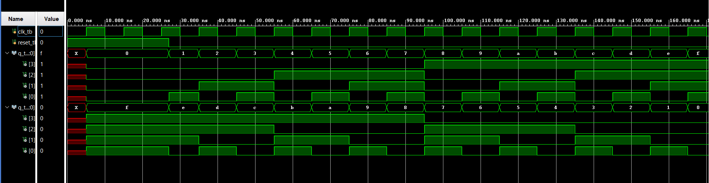

# 🔢 Up/Down Counter with Shared Testbench


---

## 📌 Project Overview

This project implements both an **Up Counter** and a **Down Counter** in Verilog HDL, tested together using a **single shared testbench**. The simulation produces a unified waveform output, making it easy to compare and understand the behaviour of both counters side by side.

---

## ✨ Features

- ✅ Synchronous Up Counter (counts 0 → 15)
- ✅ Synchronous Down Counter (counts 15 → 0)
- ✅ Single testbench for both modules
- ✅ Waveform output viewed in Vivado Simulator

---

## 🛠 Tools Used

| Tool | Purpose |
|------|---------|
| Xilinx Vivado | Design, Synthesis & Simulation |
| Verilog HDL | Hardware Description Language |

---

## 📁 File Structure

```
up-down-counter/
├── up_counter.v       ← Up counter module
├── down_counter.v     ← Down counter module
├── tb_counters.v      ← Shared testbench
├── waveform.png       ← Simulation waveform screenshot
└── README.md
```

---

## 📊 Simulation Waveform



> Waveform showing Up Counter (0→15) and Down Counter (15→0) behaviour simulated together in Xilinx Vivado.

---

## 🎓 Learning Outcome

- Understood synchronous counter design in Verilog
- Learned how to write a single testbench for multiple modules
- Analysed combined waveform output to verify correct behaviour

---

## 👨‍💻 Author

**Arshad Ansari**  
M.Tech ECE (VLSI Design) — NIT Hamirpur  
[](https://www.linkedin.com/in/arshadansari04/)
    
